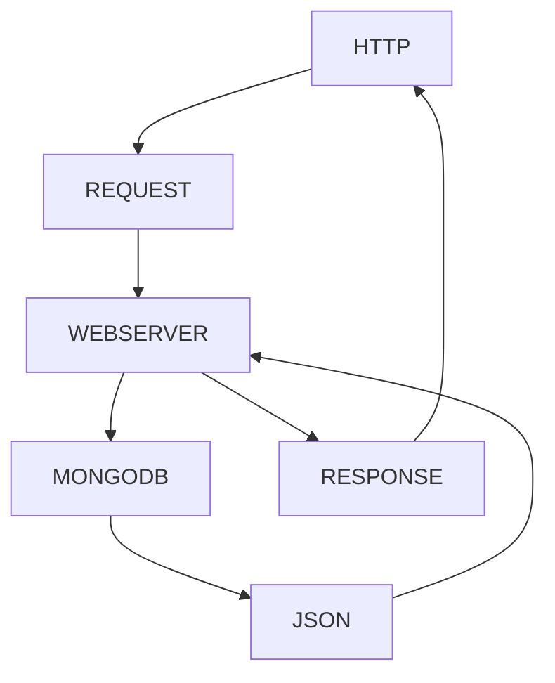

# <u>CRUD - MongoDB</u>

## Documentacion:


~~Texto tachado con virgulilla, usado para indicar "obsoletos o deprecados"~~

> El simbolo de > se utiliza para indicar una cita dentro de un bloque de texto, como aca..

#### Podemos agregar listas de tareas:
>Creamos los items de las listas utilizando el guion medio -, y agregamos checkbox con los corchetes con un espacio en blanco y los marcamos como hechos con una x dentro de los corchetes.
- [ ] instalar dependencias
- [x] iniciar configurar direccion de host y puerto a utilizar
- [x] arrancar el servidor
- [x] probar los endpoints


#### Podemos agregar código utilizando triple backticks
```
server.get('/api/productos/:id', async (req, res) => {
    const { id } = req.params

    const collection = await connectToDB('productos');
    const producto = await collection.findOne( { id: { $eq: Number(id) } } );
    
    if(!producto){
        return res.status(404).send('Error. No se encuentra producto con la ID solicitada')
    }

    res.status(200).send(JSON.stringify(producto, null, '\t'));
})
```

## Diagrama de flujo con MERMAID y MARKDOWN




### Comision 2 - *UNTREF* - **DESARROLLO BACKEND NODEJs express**


